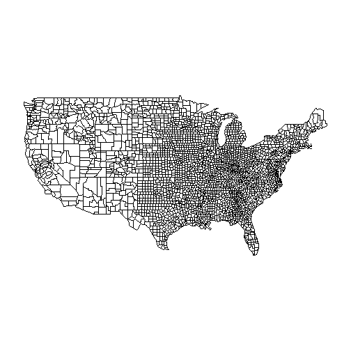
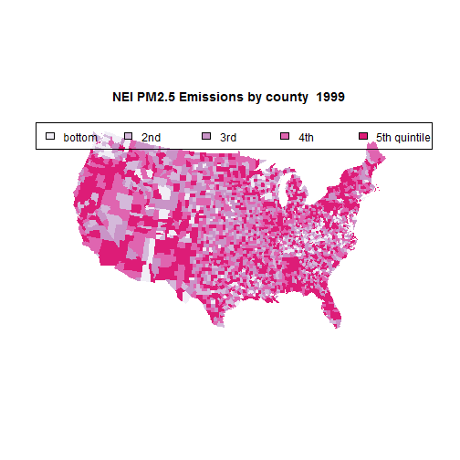
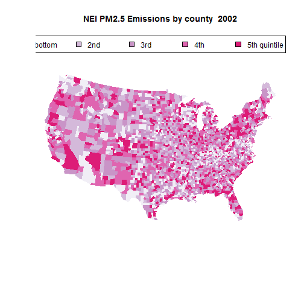
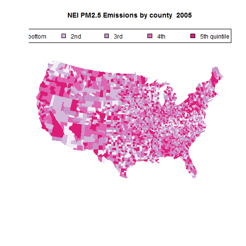
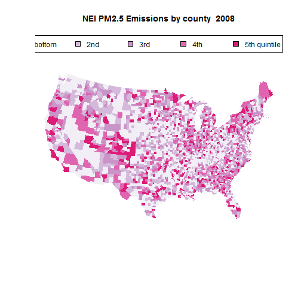

I have a high interest in mapping geospatial data and wanted to work with the data from the Exploratory Data Analysis Project 2 further so I created this additonal code which creates a Choropleth, a type of heat map, based on the total PM2.5 Emissions by each FIPS county.  For more information on FIPS county code see this page <http://en.wikipedia.org/wiki/FIPS_county_code>

The original Course Project is here - <https://class.coursera.org/exdata-010/human_grading>

This is almost entirely drawn from the code of others found on the internet - many different sources contributed.  

First, I check to see if the data is loaded to R and if not, I set the working directory and read in the data.  Because this data is in RDS format we use the readRDS function:


```r
  if(!exists("NEI")) {
    print("Reading NEI file")
    setwd("C:/Users/rr046302/Documents/Bill's Stuff/Coursera/Exploratory Data Analysis/Project 2")
    NEI <- readRDS("summarySCC_PM25.rds")
    setwd("C:/Users/rr046302/Documents/Bill's Stuff/Coursera/Reproducible Research/DataScienceSpecialization.github.io")
  }
```

Next I require several R packages - require checkes to see if the packages are loaded and if not loads them:


```r
  require(maps)
  require(ggmap)
  require(doBy)
```

Next I set the color for the color bands - here I have chosen a set of magenta colors to indicate that the Emissions is a measure of a deleterious substance in the environment:


```r
colors = c("#F1EEF6", "#D4B9DA", "#C994C7", "#DF65B0", "#DD1C77", 
             "#980043")
```

Using the doBy package I summarize Emissions by fips and year, using the FUNction sum:

```r
  fipssum <- summaryBy(Emissions ~fips + year, data = NEI, keep.names = TRUE, FUN = sum) 
```

Usign the cut and breaks function I cut the Emissions sum into 6 equal parts.  Note that I do this prior to filtering on the year as I want all 4 years to use the same color buckets so that the comparisons across all 4 years are appropriate:

```r
  fipssum$colorBuckets <- cut(fipssum$Emissions, breaks=c(quantile(fipssum$Emissions, probs = seq(0, 1, by = 0.2))),
                              labels=c(1,2,3,4,5), include.lowest=TRUE)
```

We'll start with the data for 1999 (you can fork the repo on Github that has the following code set up as a function):

```r
NEIyear <- 1999
```

And filter on year:

```r
  year <- subset (fipssum, year == NEIyear) 
```

I create an object of the colorBuckets that will be used for setting colors when I make the plot

```r
  colorsmatched <- year$colorBuckets 
```

A title is created using the NEIyear that was called by the user in the function call:

```r
  title <- paste("NEI PM2.5 Emissions by county ", NEIyear)  
```

The penultimate step is to create the plot:

```r
  windows()
  map("county")
```

 

```r
  map("county", col = colors[colorsmatched], fill = TRUE, resolution = 0, 
      lty = 0, projection = "polyconic")
  title(title)
  leg.txt <- c("bottom", "2nd", "3rd", "4th", "5th quintile")
  legend("topright", leg.txt, horiz = TRUE, fill = colors)
```

 

We'll run it again for 2002 data:

```r
NEIyear <- 2002
  year <- subset (fipssum, year == NEIyear) 
  colorsmatched <- year$colorBuckets
  title <- paste("NEI PM2.5 Emissions by county ", NEIyear)  
  map("county", col = colors[colorsmatched], fill = TRUE, resolution = 0, 
      lty = 0, projection = "polyconic")
  title(title)
  leg.txt <- c("bottom", "2nd", "3rd", "4th", "5th quintile")
  legend("topright", leg.txt, horiz = TRUE, fill = colors)
```

 

And again for 2005 data:

```r
NEIyear <- 2005
  year <- subset (fipssum, year == NEIyear)
  colorsmatched <- year$colorBuckets
  title <- paste("NEI PM2.5 Emissions by county ", NEIyear)  
  map("county", col = colors[colorsmatched], fill = TRUE, resolution = 0, 
      lty = 0, projection = "polyconic")
  title(title)
  leg.txt <- c("bottom", "2nd", "3rd", "4th", "5th quintile")
  legend("topright", leg.txt, horiz = TRUE, fill = colors)
```

 

And finally for 2008 data:

```r
NEIyear <- 2008
  year <- subset (fipssum, year == NEIyear) 
  colorsmatched <- year$colorBuckets
  title <- paste("NEI PM2.5 Emissions by county ", NEIyear)  
  map("county", col = colors[colorsmatched], fill = TRUE, resolution = 0, 
      lty = 0, projection = "polyconic")
  title(title)
  leg.txt <- c("bottom", "2nd", "3rd", "4th", "5th quintile")
  legend("topright", leg.txt, horiz = TRUE, fill = colors)
```

 

Lastly, because this was a function and the dataset exists within the function environment I check to see if the dataset is in the global environment; if it is not I assign the NEI object to the global environment:

```r
if(!exists("NEI")) {
  print("Assigning NEI to Global Environment")
  assign("NEI", NEI, envir=globalenv())
}
```

This code is avaialble in a Github repo as a function.  Find the repo here <https://github.com/BillSeliger/ExData_Plotting2>
